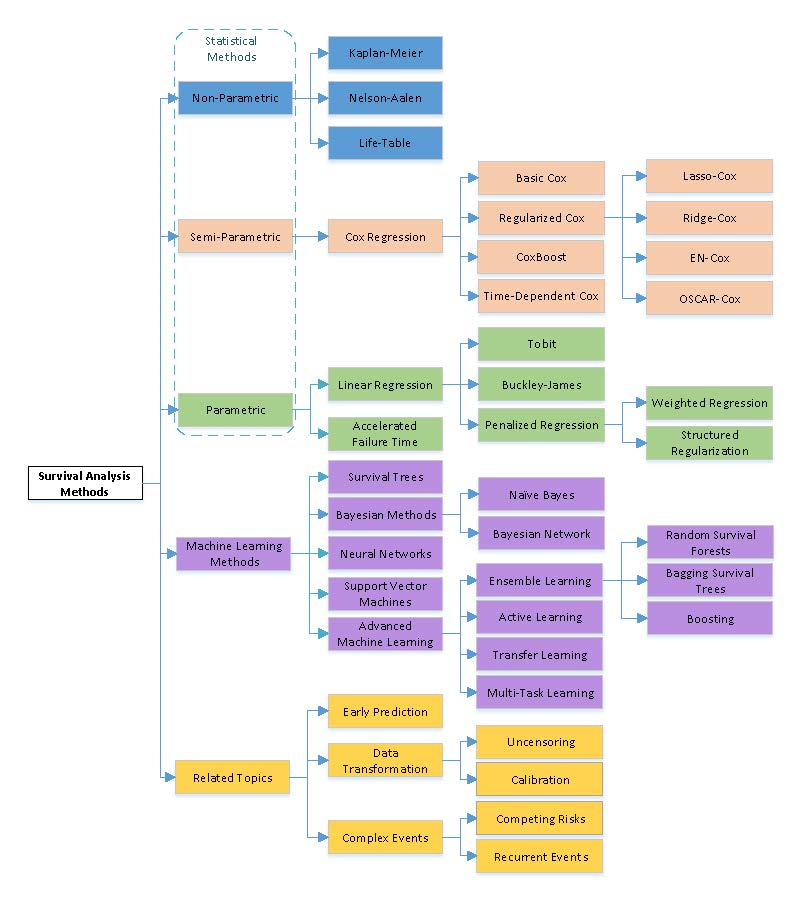

# Machine Learning for Survival Anlysis
Survival analysis is a subfield of statistics where the goal is to analyze and model data where the outcome is the time until an event of interest occurs. One of the main challenges in this context is the presence of instances whose event outcomes become unobservable after a certain time point or when some instances do not experience any event during the monitoring period. This so-called censoring can be handled most effectively using survival analysis techniques. Traditionally, statistical approaches have been widely developed in the literature to overcome the issue of censoring. In addition, many machine learning algorithms have been adapted to deal with such censored data and tackle other challenging problems that arise in real-world data. In this survey, we provide a comprehensive and structured review of the statistical methods typically used and the machine learning techniques developed for survival analysis, along with a detailed taxonomy of the existing methods. We also discuss several topics that are closely related to survival analysis and describe several successful applications in a variety of real-world application domains. We hope that this article will give readers a more comprehensive understanding of recent advances in survival analysis and offer some guidelines for applying these approaches to solve new problems arising in applications involving censored data. 

This repository summarizes the related materials related to our survey paper about machine learning for survival analysis:
[Machine Learning for Survival Analysis: A Survey](https://dl.acm.org/doi/abs/10.1145/3214306).

## Citation
Ping Wang, Yan Li, and Chandan K. Reddy. "Machine learning for survival analysis: A survey." ACM Computing Surveys (CSUR) 51.6 (2019): 1-36.

```
@article{wang2019machine,
  title={Machine learning for survival analysis: A survey},
  author={Wang, Ping and Li, Yan and Reddy, Chandan K},
  journal={ACM Computing Surveys (CSUR)},
  volume={51},
  number={6},
  pages={1--36},
  year={2019},
  publisher={ACM New York, NY, USA}
}
```

## Important Links
- Links related to this work:
  - Paper: https://dl.acm.org/doi/abs/10.1145/3214306
  - Supplemental Material: https://dl.acm.org/action/downloadSupplement?doi=10.1145%2F3214306&file=wang.zip&download=true
  - Tutorial Slides (KDD 2017): http://dmkd.cs.vt.edu/TUTORIAL/Survival/Slides.pdf
  - Tutorial Video: [Part-1](https://www.youtube.com/watch?v=GpIk1NhZiVU&t=1922s), [Part-2](https://www.youtube.com/watch?v=0UzwYWP9f8U&t=4342s&ab_channel=KDD2017video)
  - Related Datasets: http://dmkd.cs.vt.edu/projects/survival/data/
  - Related packages: http://dmkd.cs.vt.edu/projects/survival/software/
  

## Complete Taxonomy  of Survival Analysis Methods
<h2 align="center">
  
</h2>